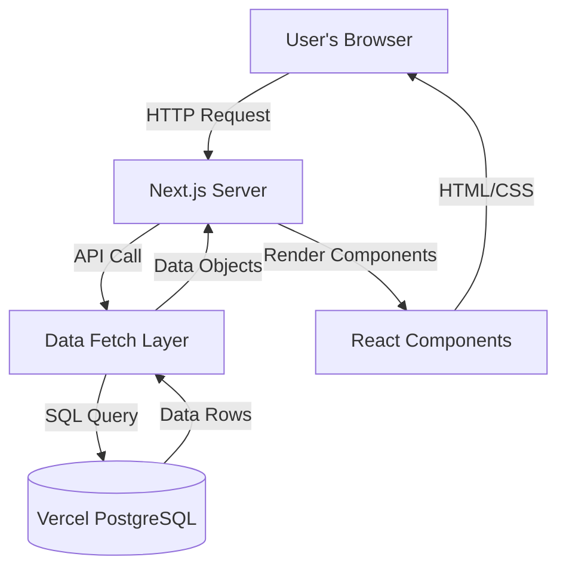

# Portfolio

A **portfolio** is a personal website that showcases your professional experience, projects, skills, and contact information. It serves as a digital resume and a platform to present your work, achievements, and interests to potential employers, collaborators, or clients.

## Tech Stack & Languages

This portfolio is built using the following technologies:

- **Next.js** (React framework for SSR/SSG)
- **React** (UI library)
- **TypeScript** (type-safe JavaScript)
- **PostgreSQL** (database, via Vercel Postgres)
- **@vercel/postgres** (database integration)
- **@vercel/blob** (asset management)
- **CSS Modules** (modular, component-scoped styles)
- **Node.js** (runtime)
- **dotenv** (environment variable management)
- **ESLint** (linting)
- **Slick Carousel** (project slider)
- **Vercel** (deployment)

## Solution Architecture

Below is a high-level architecture diagram showing the flow of data in the portfolio:



---

## Getting Started

To run the project locally:

```bash
npm install
npm run dev
```

Visit [anuj98.vercel.app](https://anuj98.vercel.app) in your browser.
